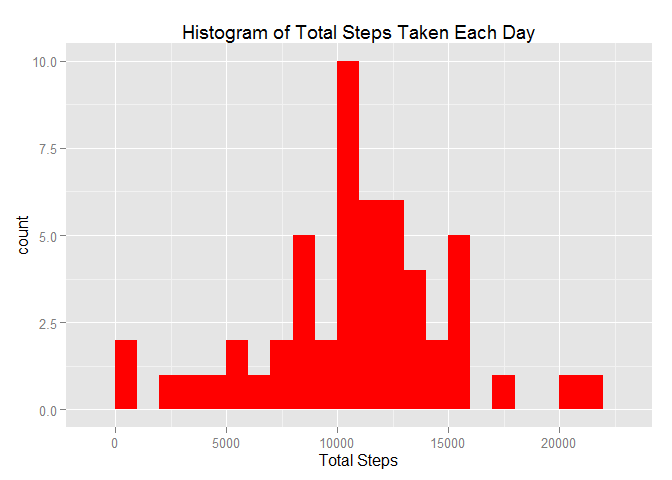
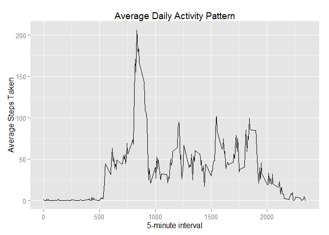
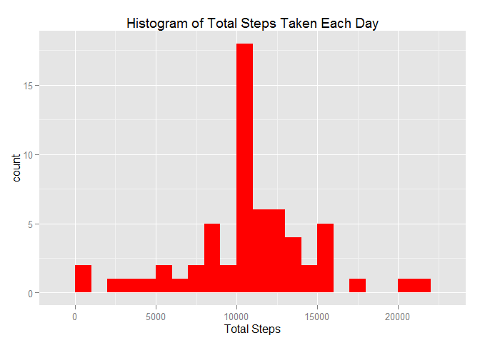
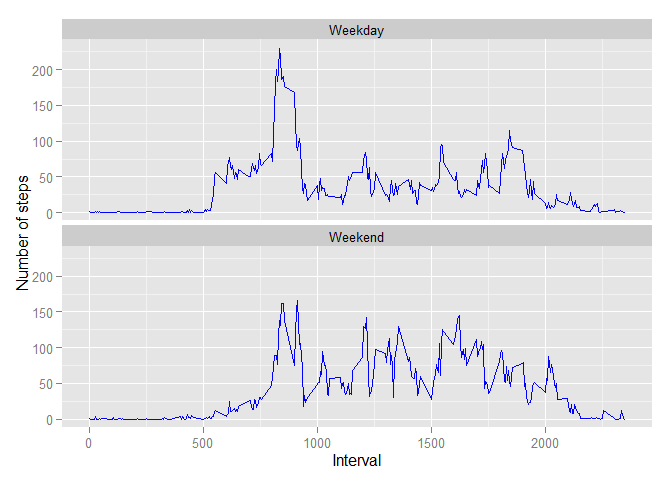

# Reproducible Research: Peer Assessment 1


## Loading and preprocessing the data
###Show any code that is needed to
1. Load the data (i.e.  read.csv() )
2. Process/transform the data (if necessary) into a format suitable for your 
analysis


```r
activity<-read.csv("activity.csv")          ## read the csv file
activity$date <- as.POSIXct(activity$date,format="%Y-%m-%d")  ## change to POSIXct class
```

## What is mean total number of steps taken per day?
1. Calculate the total number of steps taken per day
2. Ignore the missing values in the dataset.

```r
##calculate the total steps per day for each date and ignore/exclude the 
##NA values.  
TotalSteps <- aggregate(steps~date, data=activity, sum, na.rm=TRUE)
```
3. Make a histogram of the total number of steps taken each day

```r
library(ggplot2)
#create the histogram
ggplot(TotalSteps, aes(x = steps)) + 
       geom_histogram(fill = "red", binwidth = 1000) + 
        labs(title="Histogram of Total Steps Taken Each Day", 
             x = "Total Steps") 
```

 

4. Calculate and report the mean and median total number of steps taken per day

```r
## mean value of the total number of steps taken per day
mean.steps <- mean(TotalSteps$steps) 
mean.steps
```

```
## [1] 10766.19
```

```r
## median value of the total number of steps taken per day
median.steps <- median(TotalSteps$steps)
median.steps  
```

```
## [1] 10765
```
The mean steps taken per day is 10766.19.   
The median steps taken per day is 10765. 

## What is the average daily activity pattern?
1.Make a time series plot (i.e.  type = "l" ) of the 5-minute interval (x-axis)
and the average number of steps taken, averaged across all days (y-axis)

```r
##Calculate the average steps for each interval and ignore/exclude the
##NA values. 
AverageSteps <- aggregate(steps ~interval, data=activity, mean, na.rm=TRUE)
##create the time series plot
ggplot(AverageSteps, aes(x = interval, y = steps)) + geom_line() +
        labs(title="Average Daily Activity Pattern",
                 x ="5-minute interval",
                 y= "Average Steps Taken")
```

 

2.Which 5-minute interval, on average across all the days in the dataset, 
contains the maximum number of steps?

```r
## The 5 minute interval with the maximum number of steps
MaxSteps<- AverageSteps[which.max(AverageSteps$steps), ]
MaxSteps
```

```
##     interval    steps
## 104      835 206.1698
```
#### The interval with the max value of steps is 835


## Imputing missing values
####Note that there are a number of days/intervals where there are missing values 
####(coded as  NA ). The presence of missing days may introduce bias into some 
####calculations or summaries of the data.
1. Calculate and report the total number of missing values in the dataset (i.e. 
the total number of rows with NAs)

```r
MissingValues<- nrow(activity) - nrow(na.omit(activity))
MissingValues
```

```
## [1] 2304
```
The total number of missing values in the dataset is 2304

2. Devise a strategy for filling in all of the missing values in the dataset.The
strategy does not need to be sophisticated. For example, you could use the 
mean/median for that day, or the mean for that 5-minute interval, etc.

```r
## get the mean steps for each interval
AverageSteps <- aggregate(steps ~ interval, data = activity, mean)

subNA <- numeric()  #  create an a numeric vector
for (i in 1:nrow(activity)) {
    rownum <- activity[i, ]
    
    if (is.na(rownum$steps)) {
        steps <- AverageSteps[rownum$interval==AverageSteps$interval,]$steps
    } 
    else {
        steps <- rownum$steps

    }
    
    subNA <- c(subNA, steps)  ## fill the subNA vector with the values in steps
}
```

3. Create a new dataset that is equal to the original dataset but with the 
missing data filled in.

```r
## new_dataset is a duplicate of the activity dataset
new_dataset <- activity

## substitute the value of the column "steps" in the new_dataset with the values
## from subNA
new_dataset$steps <- subNA  
head(new_dataset)
```

```
##       steps       date interval
## 1 1.7169811 2012-10-01        0
## 2 0.3396226 2012-10-01        5
## 3 0.1320755 2012-10-01       10
## 4 0.1509434 2012-10-01       15
## 5 0.0754717 2012-10-01       20
## 6 2.0943396 2012-10-01       25
```

4. Make a histogram of the total number of steps taken each day and calculate 
and report the mean and median total number of steps taken per day. Do these values
differ from the estimates from the first part of the assignment? What is the 
impact of imputing missing data on the estimates of the total daily number of 
steps?

```r
TotalSteps_new <- aggregate(steps~date, data=new_dataset, sum)
head(TotalSteps_new)
```

```
##         date    steps
## 1 2012-10-01 10766.19
## 2 2012-10-02   126.00
## 3 2012-10-03 11352.00
## 4 2012-10-04 12116.00
## 5 2012-10-05 13294.00
## 6 2012-10-06 15420.00
```

```r
#create the histogram
ggplot(TotalSteps_new, aes(x = steps)) + 
       geom_histogram(fill = "red", binwidth = 1000) + 
        labs(title="Histogram of Total Steps Taken Each Day", 
             x = "Total Steps") 
```

 


```r
AverageSteps_new <-mean(TotalSteps_new$steps)
AverageSteps_new
```

```
## [1] 10766.19
```

```r
MedianSteps_new <- median(TotalSteps_new$steps)
MedianSteps_new
```

```
## [1] 10766.19
```
The average for the new dataset is 10766.19
The median for the new dataset is 10766.19

The average is the same as the first part of the assignment but the median value
differs slightly from the first part of the assignment. The median value without
replacing the NA values is 10765 and 10766.19 after replacing the NA values with
the average values of the interval.
In this case the impact of imputing missing data was very minimal. Just 
a difference of 1.19 for the median.


## Are there differences in activity patterns between weekdays and weekends?
### For this part the  weekdays()  function may be of some help here. Use the 
### dataset with the filled-in missing values for this part.

1.Create a new factor variable in the dataset with two levels -- "weekday" and 
"weekend" indicating whether a given date is a weekday or weekend day.

2.Make a panel plot containing a time series plot (i.e.  type = "l" ) of the 
5-minute interval (x-axis) and the average number of steps taken, averaged across
all weekday days or weekend days (y-axis). 


```r
## create a new dataset with a new column that defines if it is a weekday or weekend
## using the imputed missing value dataset
weekday <- weekdays(new_dataset$date)

Weekday_level <- character()       ## create an character vector
for (i in 1:length(weekday)) {
    if (weekday[i] == "Saturday") {
        Weekday_level[i] <- "Weekend"
    } 
    else if (weekday[i] == "Sunday") {
        Weekday_level[i] <- "Weekend"
    } 
    else {
        Weekday_level[i] <- "Weekday"
    }
}

new_dataset$weekday_level <- as.factor(Weekday_level)

AverageSteps <- aggregate(steps ~ interval+weekday_level , data = new_dataset, mean)


ggplot(AverageSteps, aes(x = interval, y = steps)) + geom_line(color="blue") +
        facet_wrap(~ weekday_level, nrow=2, ncol=1) +
        labs(x="Interval", y="Number of steps") 
```

 

Looks like on the weekdays the average steps taken are more before the 1000th interval 
compared to the weekend.  On the weekends the average steps taken tend to go up from the 
1000th interval.  This maybe due to getting a later start on the weekend when people generally tend to sleep in and then being more active as the day progresses.  
